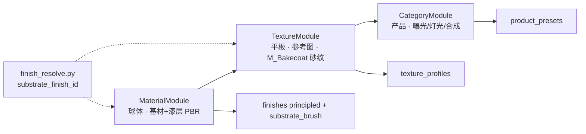

# 统一校准管线设计思想

## 定位

CADRender 的 look-dev 校准目标是：**让 catalog 出图风格稳定、可复现**，而非实验室 BRDF 测量。

**业务产出公式**：

```
高清效果图 = 参数化模型 × 可选材质(finish) × 可选纹理(texture) × 场景(category/scene)
```

- **生产入口**：`scripts/render.py`（`--model` / finish / texture / `--category` / `--scene`）  
- **校准分工**：Material → Texture → Category 分维定稿，**组合态验收**（见 [texture_calibration_roadmap.md](./texture_calibration_roadmap.md) §1）  
- **当前阻塞**：**纹理维（outdoor_sand）** — 风险最高，必须先解阻塞；category 批量与其余 finish **冻结**（见 roadmap §0）  
- 纹理平板 PASS ≠ 业务 PASS；必须在代表产品模型 + 场景上复验 HD 成片  

所有校准入口收敛为 **一个 CLI**（`scripts/calibrate.py`），通过 `--scope` 选择子模块组合。

```
scripts/calibrate.py                    ← 唯一 CLI 入口
    └── orchestration/calibration/
            pipeline.py                 ← 编排：阶段顺序、报告、写盘
            material_module.py          ← 子模块 A：材质球 PBR
            texture_module.py           ← 子模块 B：参考图纹理
            category_module.py          ← 子模块 C：产品类目
            texture_engine.py           ← 纹理引擎（生产 bakecoat + 对称评分）
            shared/
                scene_sphere.py
                scene_texture_panel.py
                live_review.py               ← 校准中桌面双栏审查
                texture_vlm_loop.py          ← VLM 多轮闭环 + bounds 调整
                scoring_reference.py
                finish_resolve.py          ← 铝基材 + 漆面 merge
                write_presets.py
```

## 核心原则：场景与评分各归其位

| 子模块 | 载体 | 评分依据 | 产出 |
|--------|------|----------|------|
| **Material** | 材质球（生产对齐灯光/HDRI） | 启发式 + 可选金标球图；阴影区 CIEDE2000 | `finishes/*.json` → `principled` + 基材 `substrate_brush` |
| **Texture** | 纹理平板 + 掠射光 | **蚁力色卡裁剪参考图**；对称特征 + 可选 VLM | `texture_profiles/*.json` + 漆面 `bakecoat_procedural` |
| **Category** | 代表产品模型 + 全管线 | Gate / CV / 可选 VLM | `product_presets.json` |

**铝型材 + 喷涂**：Finish 名（如 `outdoor_sand`）是 **漆面纹理**，不是独立基材。通过 `substrate_finish_id: brushed_aluminum_voronoi` 合并拉丝铝；Ball 定基材与漆层，Plane 定砂纹颗粒（见 `finish_resolve.py`）。

**执行优先级（2026-06-25）**：Texture 子模块为 **P0 阻塞**；Material 可锁定配合；Category **延后**至 outdoor_sand 纹理在 `render.py` 成片 PASS。

**为什么材质用球、纹理用参考图？**

- 球体：几何固定，适合分离 BRDF（roughness / metallic / specular / coat）与曝光，颜色用阴影区 albedo 评估有意义。
- 参考图：纹理是 **2D 表面统计**（砂粒、波纹、爆花），应与蚁力实物色块同几何（平面、同尺度）对比；球体曲率会扭曲颗粒观感，且与色卡拍摄条件不一致。

三者 **目标函数不同**，必须在不同场景下搜参，顺序执行、分别写盘，避免互相污染。

## 一次性执行 vs 单独环节

**统一入口** `scripts/calibrate.py`，通过 `--scope` 选择跑哪些子模块。可 **串联一次性跑完**，也可 **只跑某一环** 迭代。

| `--scope` | 执行顺序 | 必填参数 | 典型场景 |
|-----------|----------|----------|----------|
| `finish` | Material → Texture | `--finish-id` + `--reference` | **推荐**：单 finish look-dev（如 `outdoor_sand`） |
| `full` | Material → Texture → Category* | 上列 + `--model` | finish 定稿后连产品曝光/灯光/合成 |
| `material` | Material 仅 | `--finish-id` | 只调球体 PBR / coat / 基材各向异性 |
| `texture` | Texture 仅 | `--finish-id` + `--reference` | PBR 已满意，只重跑砂纹 vs 蚁力参考 |
| `category` | Category 仅 | `--model` + category preset | finish 已锁定，只调类目 preset |

\* `full` 在未传 `--model` 时 **自动跳过** Category，等价于 `finish`。

**兼容旧命令**：`--mode material|texture|category` 分别等价于上表三个单环节 scope；**不含** `finish` / `full`（请改用 `--scope`）。

**写盘**：各阶段独立写入对应 preset（`finishes/`、`texture_profiles/`、`product_presets.json`），互不覆盖对方职责。审查阶段加 `--no-auto-write`，确认满意后去掉该参数重跑或 UI 写入。

## Scope 与执行顺序

| `--scope` | 阶段 | 依赖 |
|-----------|------|------|
| `material` | MaterialModule | `--finish-id` |
| `texture` | TextureModule | `--finish-id` + `--reference`（蚁力裁剪，**必填**） |
| `category` | CategoryModule | `--model` + `product_presets.json` |
| `finish` | material → texture | 同上；推荐 look-dev 主路径 |
| `full` | finish → category（有 `--model` 时） | 完整链路 |



**推荐生产 look-dev 顺序：**

```
--scope finish（材质球 PBR + 参考图纹理）→ 可选 --scope category → render.py 出图
```

`--mode material|texture|category` 为兼容别名，映射到对应 scope；**不含** `finish` / `full`。

## Material 子模块

- 实现：`material_module.py` → `orchestration.material_calibrate.calibrate_material`
- **职责边界**：材质球 **只做 PBR**（含铝基材各向异性 + 漆层 coat）；**不在球上搜 bakecoat 砂纹/噪波纹理**。
- 默认 `skip_texture=True`，纹理交给 **TextureModule**（`--scope finish` / `--scope texture`）。
- 旧行为（球上 Phase 2 启发式纹理）：`--legacy-heuristic-texture`（不推荐，与 reference 纹理模块二选一）
- Phase 1：plain Principled + 可选基材 brush（Voronoi 拉丝），**不含** M_Bakecoat 漆面砂纹。
- 详见 [material_calibration_guide.md](./material_calibration_guide.md)

## Texture 子模块

- 实现：`texture_module.py` → `texture_engine.calibrate_texture_reference`
- **硬约束**：无 `--reference` 拒绝启动。
- **生产材质**：`build_bakecoat_principled` + `M_Bakecoat`（禁止简化节点树）。
- **场景**：`CalPanel` 平板 + Key/Fill 掠射光 + 暗世界光；`base_color` 固定中灰（颜色解耦）。
- **评分**：对称预处理 + **bakecoat roughness 特征 pass**（paint-only，无基材 Voronoi）+ **方向性 isotropy 惩罚**（20%）
- **Beauty 审查**：paint-only + 完整 coat 栈；trial 512²，export 768²
- **Live Review**：每 trial **先 proxy（~20s）再 beauty 双栏**
- **搜索**：单阶段多变量 Optuna（`bump`、`micro/fine`、`rough_mix_factor`、`rough_ramp`）。
- **可选 VLM**：特征 top-3 → 人眼相似度精调。
- 写入：`finishes/<id>.json` + `texture_profiles/<id>.json`
- 详见 [texture_calibration_design.md](./texture_calibration_design.md)
- **推进顺序**：Phase 0 仅 outdoor_sand → [texture_calibration_roadmap.md](./texture_calibration_roadmap.md)（含业务四维、调研报告对齐、纹理双轨）

## Category 子模块

- 实现：`category_module.py` → `orchestration.calibrate_pipeline.calibrate_category`
- 在 **已锁定 finish（PBR + texture_profile）** 上调节曝光、灯光倍率、合成。
- 详见 [category_calibration_guide.md](./category_calibration_guide.md)

## 配置分层（颜色 / 纹理 / PBR）

```
texture_profiles/<id>.json      ← bakecoat 纹理参数（独立）
    ↑ texture_profile 引用
finishes/<id>.json              ← principled PBR + 纹理引用
    ↑ catalog_color
catalog_colors.json             ← RAL 色库（颜色维度）
```

合并逻辑：`resolve_texture_profile_bakecoat()` 在渲染与校准时将 texture_profile 并入 finish。

## CLI 示例

```powershell
cd blenderworker
$env:PYTHONPATH = "src"

# ── 一次性：材质球 + 纹理平板（推荐）──
python scripts/calibrate.py `
  --scope finish `
  --finish-id outdoor_sand `
  --reference ../outputs/yili_crops/outdoor_sand/outdoor_sand_crop.png `
  --no-auto-write

# 确认审查图后写入 preset（去掉 --no-auto-write）
python scripts/calibrate.py `
  --scope finish `
  --finish-id outdoor_sand `
  --reference ../outputs/yili_crops/outdoor_sand/outdoor_sand_crop.png

# ── 一次性：材质 + 纹理 + 类目 ──
python scripts/calibrate.py `
  --scope full `
  --finish-id outdoor_sand `
  --reference ../outputs/yili_crops/outdoor_sand/outdoor_sand_crop.png `
  --model assets/guardrial.obj `
  --category aluminum_6063 `
  --no-auto-write

# ── 单独：仅材质球 PBR ──
python scripts/calibrate.py --scope material --finish-id outdoor_sand

# 带多模型迁移验证（仍仅 material 阶段）
python scripts/calibrate.py --scope material `
  --finish-id powder_matte `
  --models assets/guardrial.obj,assets/简易款-BodyPad003.obj `
  --category aluminum_6063

# ── 单独：仅纹理（PBR 已人工确认）──
python scripts/calibrate.py `
  --scope texture `
  --finish-id outdoor_sand `
  --reference ../outputs/yili_crops/outdoor_sand/outdoor_sand_crop.png `
  --texture-trials 10 `
  --no-auto-write

# 仅重导纹理审查图（已有 best_params，需 Blender 在线）
python scripts/render_texture_review.py --finish-id outdoor_sand

# ── 单独：仅类目（finish 已锁定）──
python scripts/calibrate.py --scope category `
  --model assets/guardrial.obj `
  --category aluminum_6063 `
  --no-auto-write
```

### 常用跨阶段参数

| 参数 | 说明 |
|------|------|
| `--no-auto-write` | 只出 `calibrate_out` 审查产物，不写 preset JSON |
| `--force-write` | 材质阶段验证失败仍写入 finish（慎用） |
| `--dry-run` | 打印变更预览 |
| `--material-trials N` | 材质球 Optuna 轮数（默认 32） |
| `--texture-trials N` | 纹理 Optuna 轮数（warm-start 默认 10，否则 50） |
| `--texture-eevee-preview` | 纹理 Optuna 阶段使用 EEVEE Next 加速 ~10x，随后 Cycles 精调 |
| `--texture-refine-cycles-trials N` | Cycles 精调 trial 数（默认 8，仅 `--texture-eevee-preview` 时生效） |
| `--texture-vlm-loop` | 纹理多轮：每轮 Optuna 后 VLM 评 proxy vs 参考，自动调 bounds |
| `--texture-vlm-max-rounds` | VLM 闭环最大轮数（默认 3） |
| `--texture-vlm-pass-score` | VLM overall_score 达标阈值（默认 0.72） |
| `--live-review` / `--live-review-wait` | 校准中桌面双栏审查 |
| `--search-samples` / `--confirm-samples` | 256 / 1024 spp（材质确认阶段） |
| `--skip-confirm` | 材质球跳过 1024spp 确认 |
| `--use-vlm` | 纹理或类目阶段启用 VLM 精调 |
| `--reference` | 纹理：**必填**（蚁力 crop）；材质：可选金标球图 |

### 审查 UI

| 方式 | 说明 |
|------|------|
| **Live Review（校准中）** | `--live-review` 弹出桌面窗口：**上一张 / 当前** 双栏；每栏 **Beauty PBR \| Proxy 伪彩**；纹理 trial **先推送 proxy、再 beauty**；`--live-review-wait` 需点 Continue |
| **验收渲染（定稿后）** | `scripts/acceptance_finish.py`：生产全栈金属球 + 平板 `compare_triple`（见下节） |
| Admin 事后复核 | `/admin/calibration`（需挂载 `calibrate_out`） |

| Tab | 内容 |
|-----|------|
| 材质校准 | 球体 PBR trial + confirm（**不含** reference 纹理 trial） |
| 纹理校准 | 平板 trial + `compare_triple.png` 三栏对比 |
| 类目校准 | 产品 Top-K 候选 |

```powershell
# 校准中实时看图（每张 beauty 额外渲染，耗时约 ×2）
python scripts/calibrate.py --scope finish `
  --finish-id outdoor_sand `
  --reference ../outputs/yili_crops/outdoor_sand/outdoor_sand_crop.png `
  --live-review

# 人工 gate：每帧点 Continue 再继续 Optuna
python scripts/calibrate.py --scope texture `
  --finish-id outdoor_sand `
  --reference ../outputs/yili_crops/outdoor_sand/outdoor_sand_crop.png `
  --live-review --live-review-wait

# 归档上一轮 → 重跑 → 自动对比（round_comparison.md）
python scripts/run_texture_cal_round.py `
  --finish-id outdoor_sand `
  --reference ../outputs/yili_crops/outdoor_sand/outdoor_sand_crop.png `
  --archive-label pre_isotropy_paint_only `
  --texture-trials 24 --texture-vlm-max-rounds 1 `
  --live-review --no-auto-write
```

产物：`calibrate_out/live_review/current.png`（最新帧）、`human_scores.jsonl`（将来评分写入）。

### 定稿验收（材质 + 纹理写入 preset 后）

```powershell
cd blenderworker
$env:PYTHONPATH = "src"

# 金属球（生产全栈：基材 + 漆层 + 砂纹）+ 平板 compare_triple
python scripts/acceptance_finish.py --finish-id outdoor_sand

# 从 VLM 各轮中选 feature 最高一轮写入 preset（非最终 VLM 选中 trial）
python scripts/write_feature_best_round.py outdoor_sand

# 仅金属球预览（勿用 --calibration，该模式会剥掉漆面砂纹）
python scripts/preview.py --finish outdoor_sand --texture outdoor_sand --samples 256
```

| 产物 | 路径 |
|------|------|
| 金属球验收 | `calibrate_out/acceptance_<id>/shader_ball.png` |
| 平板三栏 | `calibrate_out/texture_<id>/compare_triple.png` |

## 产物与报告

| 路径 | 内容 |
|------|------|
| `calibrate_out/calibration_pipeline_report.json` | 全 pipeline 摘要 |
| `calibrate_out/material_<id>/` | 材质球 trial / confirm / validation |
| `calibrate_out/texture_<id>/` | 纹理平板 trial / vlm 候选 / `round_comparison.md` |
| `calibrate_out/texture_<id>/archive/` | 上一轮归档（`run_texture_cal_round.py`） |
| `calibrate_out/<cam>/category_calibration_report.json` | 类目校准报告 |

## 环境

完整变量表与机器可读配置块见 [environment_config.md](./environment_config.md)。

- 一键加载：`.\scripts\load_calibration_env.ps1` 或 `calibrate.py` 启动时自动加载
- 宿主机 Blender TCP `:19876`（headless Cycles）
- 服务端推荐 Docker Compose（`docker-compose.dev.yml`）
- 纹理/类目 VLM：通义 DashScope，`CADRENDER_VLM_MODEL=qwen3.5-flash`（替代旧 `qwen-vl-*`）
